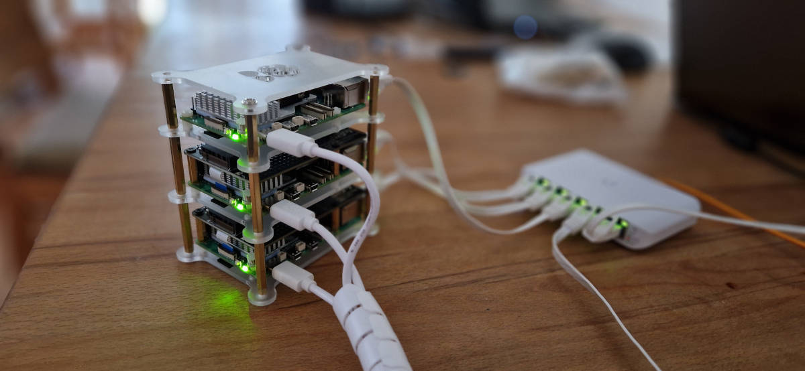
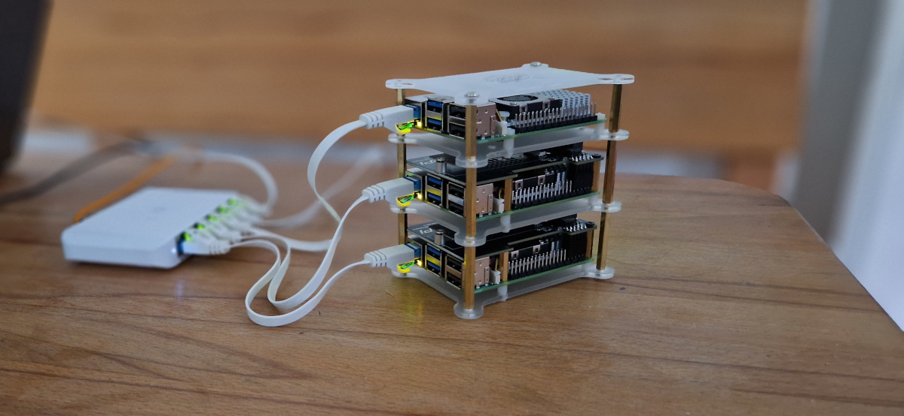

# Raspberry Pi 5 Kubernetes Cluster

## Front


## Back



## Bill of Materials 

### Hardware

- 3 x Raspberry Pi 5
- 3 x Raspberry Pi 5 Original Power Supply
- 3 X Raspberry Pi Active Cooler
- 2 x GeeekPi N04 M.2 M-Key NVMe SSD Shield for Raspberry Pi 5
- 2 x WD_BLACK SN770 NVMe SSD
- 3 x Amazon Basics MicroSD Card

### Network

- 1 x Ubiquiti UniFi Switch Flex Mini
- 3 x Flat Patch Cable 0.25m

### Case

- Joy-it RB-Case+19 SBC-Acrylic-Case 
- Hex Spacers M3*35

### Misc

- ORICO M.2 NVMe SSD Enclosure
- shinfly 2 x 1.5 m Cable Sleeve

## Pre-Installation steps

Apply before setting up cluster with kubespray


## Change boot order to boot from NVMe SSD

```bash
# Edit the EEPROM on the Raspberry Pi 5.
sudo rpi-eeprom-config --edit

# Change the BOOT_ORDER line to the following:
BOOT_ORDER=0xf416

# Add the following line if using a non-HAT+ adapter:
PCIE_PROBE=1

# Press Ctrl-O, then enter, to write the change to the file.
# Press Ctrl-X to exit nano (the editor).
```
Then restart machine

## Install tools

```bash
ansible-playbook -i inventory/friclu.yaml raspberry.yaml  
ansible-playbook -i inventory/friclu.yaml duckdns.yaml  
ansible-playbook -i inventory/friclu.yaml restic.yaml  
```

## Manage K8s with [Kubespray](https://github.com/kubernetes-sigs/kubespray)

### Install K8s

```bash
make -B create-cluster
```
### Upgrade K8s

```bash
make -B upgrade-cluster k8s_version=v1.29.2
```

### Remove K8s

```bash
make -B reset-cluster
```
